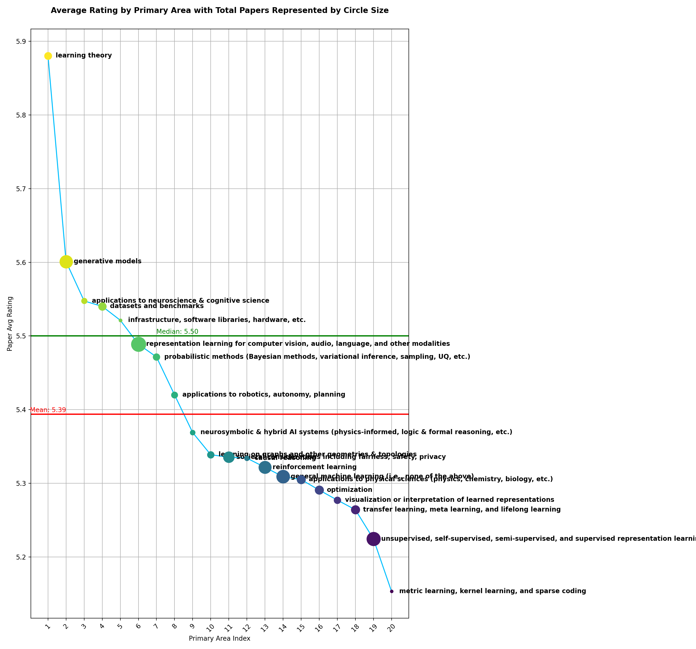
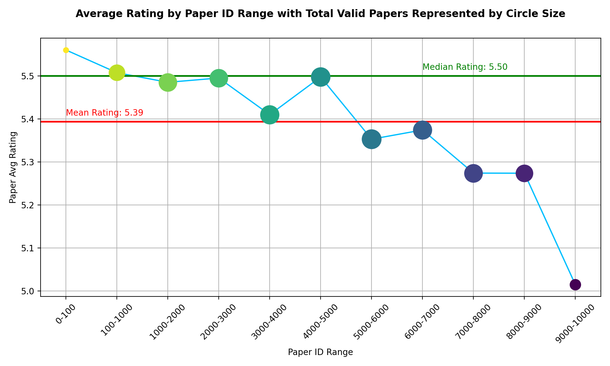
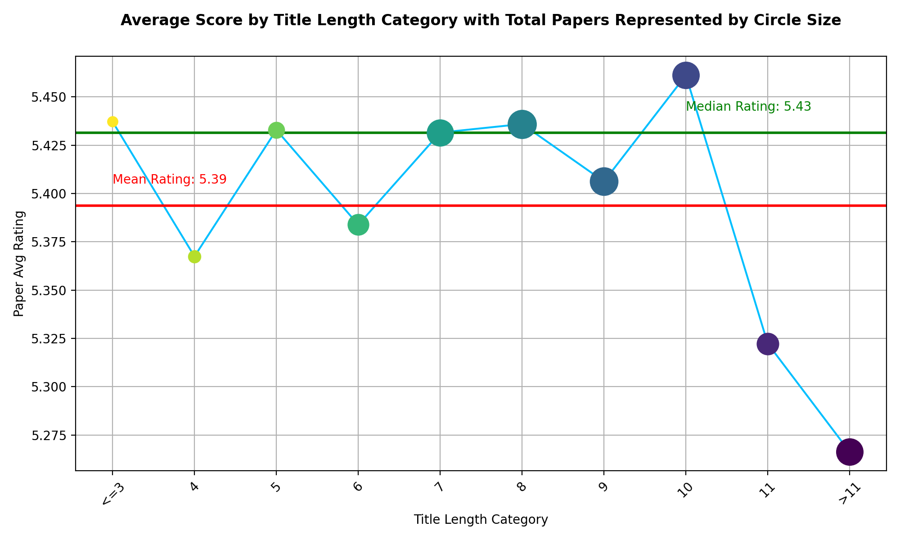

# :full_moon_with_face: ICLR24 Playground
In this project, collaborate with GPT4-Classic (~~GPT4-V is stupid~~) we crawl the metadata of all active [ICLR2024](https://openreview.net/group?id=ICLR.cc/2024/Conference) submissions, and explore the following contents:

* Fact of submission statistics
* Intuitive Myths of Submission : )
* Powered by [FIND](), we support fetching the top related articals given keywords together with the ratings.
* Powered by [GPT4](), we support rating by abstract and tittle with in context learning capability.

## Statistics
Until **Dec.30.2023**, we get the following statistics:

&#8594; Total Number of **Active** Papers: 5916  
&#8594; Total Number of **Active** Reviews: 22824  
&#8594; Average Rating: 5.39  
&#8594; Median Rating: 6.00

## Myths
:interrobang: *The ratings are biased towards the primary research area:*

:interrobang: *The ratings are biased towards paper id:*

:interrobang: *The ratings are biased towards paper title length:*

